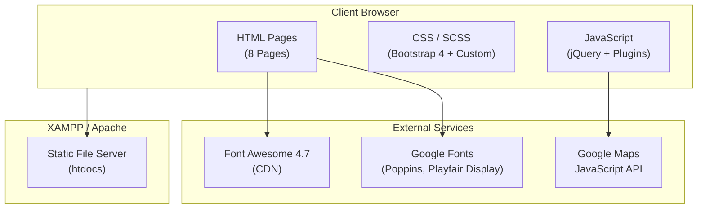

# Vacation Room Hotel Booking — Project Documentation

> **Version:** 1.0 · **Last Updated:** 2026-08-15 · **Repository:** `baohuy2209/vacation-room-hotel-booking`

---

## Table of Contents

1. [Executive Summary & Problem Statement](#1-executive-summary--problem-statement)
2. [System Architecture & High-Level Design](#2-system-architecture--high-level-design)
3. [Tech Stack & Infrastructure](#3-tech-stack--infrastructure)
4. [Key Modules & Functional Capabilities](#4-key-modules--functional-capabilities)
5. [API & Integration Strategy](#5-api--integration-strategy)
6. [Developer Guide & Setup Workflow](#6-developer-guide--setup-workflow)
7. [Scalability & Technical Considerations](#7-scalability--technical-considerations)

---

## 1. Executive Summary & Problem Statement

### Business Context

**Vacation Room Hotel Booking** is a front-end web application designed to serve as a marketing and booking interface for vacation rental and hotel accommodation services. The platform presents featured hotels across multiple global locations (Cairo, New York, Paris), displays available apartment rooms with detailed specifications, and provides a streamlined booking flow with user registration and authentication screens.

### Core Problem Solved

The application addresses the need for a **visually rich, responsive vacation rental showcase** that enables potential guests to:

- Browse featured hotel properties across international locations
- Explore detailed apartment room listings with specifications (capacity, size, view, bed count)
- Access a room-level booking form with check-in/check-out date selection
- Register and authenticate as users
- Contact the property management team via a structured contact form with integrated Google Maps

### Primary Target Users

| User Segment | Description |
|---|---|
| **Vacation Travelers** | Individuals and families seeking short-term apartment rentals for holidays |
| **Business Travelers** | Professionals looking for accommodation near major cities (New York, Cairo, Paris) |
| **Property Administrators** | Business owners using the site as a customer-facing showcase and booking intake channel |

---

## 2. System Architecture & High-Level Design

### Architectural Pattern

**Static Multi-Page Application (MPA)** — The project follows a traditional static website architecture with no server-side rendering framework, no build pipeline (beyond SCSS compilation), and no client-side SPA router. Each page is a standalone HTML document served directly by the web server.

### Architecture Diagram



### Core Building Blocks

| Block | Description |
|---|---|
| **HTML Pages** | 8 static `.html` files forming the complete page structure |
| **CSS Layer** | Bootstrap 4 grid + compiled SCSS custom stylesheet (`style.css`, 254 KB) |
| **JS Layer** | jQuery ecosystem with 15+ plugins for UI interactions |
| **External CDNs** | Google Fonts, Font Awesome 4.7, Google Maps API |
| **Static Server** | XAMPP Apache serving files from `htdocs/` |

---

## 3. Tech Stack & Infrastructure

### Frontend Technology Matrix

| Category | Technology | Version | Purpose |
|---|---|---|---|
| **Markup** | HTML5 | — | Semantic page structure |
| **Styling Framework** | Bootstrap | 4.x | Responsive grid system & UI components |
| **CSS Preprocessor** | SCSS (Sass) | — | Custom styles with variables & mixins |
| **Custom Stylesheet** | `style.css` | — | 254 KB compiled output from `style.scss` |
| **Typography** | Google Fonts | — | Poppins (primary), Playfair Display (secondary) |
| **Icons** | Font Awesome | 4.7.0 | Icon library via StackPath CDN |
| **Icons (Custom)** | Flaticon | — | Custom icon font for amenity icons |

### JavaScript Dependencies

| Library | File | Purpose |
|---|---|---|
| **jQuery** | `jquery.min.js` + `jquery-3.2.1.min.js` | DOM manipulation, AJAX, event handling |
| **jQuery Migrate** | `jquery-migrate-3.0.1.min.js` | Backward compatibility layer |
| **Popper.js** | `popper.min.js` | Tooltip/popover positioning (Bootstrap dep.) |
| **Bootstrap JS** | `bootstrap.min.js` | Navbar toggler, modals, tooltips, collapse |
| **Owl Carousel** | `owl.carousel.min.js` | Testimonial carousel (About page) |
| **Stellar.js** | `jquery.stellar.min.js` | Parallax scrolling effects |
| **Waypoints** | `jquery.waypoints.min.js` | Scroll-triggered animations |
| **Animate Number** | `jquery.animateNumber.min.js` | Counter animations |
| **Bootstrap Datepicker** | `bootstrap-datepicker.js` | Check-in/Check-out date selectors |
| **jQuery Timepicker** | `jquery.timepicker.min.js` | Time selection widget |
| **Magnific Popup** | `jquery.magnific-popup.min.js` | Image lightbox / media popups |
| **Scrollax** | `scrollax.min.js` | Scroll-based parallax effects |
| **jQuery Easing** | `jquery.easing.1.3.js` | Extended easing functions for animations |
| **Google Maps API** | External CDN | Interactive map on Contact page |
| **Custom App Logic** | `main.js` | App initialization & plugin configuration |

### Infrastructure

| Component | Technology |
|---|---|
| **Web Server** | XAMPP (Apache HTTP Server) |
| **Deployment Target** | `C:\xampp\htdocs\vacation-room-hotel-booking\` |
| **Version Control** | Git (`.git` directory present) |

> **Note:** This project has **no build tools** (no Webpack, Vite, Gulp, or npm/package.json), **no backend runtime** (no Node.js, PHP, or Python server logic), **no database**, and **no CI/CD pipeline**. All assets are statically served.

---

## 4. Key Modules & Functional Capabilities

### 4.1 Page Inventory

The application consists of **8 distinct HTML pages**, each serving a specific functional purpose:

| # | Page | File | Lines | Description |
|---|---|---|---|---|
| 1 | **Home** | `index.html` | 416 | Landing page with hero section, featured hotels, room showcase, amenities, and CTA |
| 2 | **About** | `about.html` | 391 | Company overview, service cards, client testimonials carousel, amenities |
| 3 | **Services** | `services.html` | 290 | Service offerings (Map Direction, Accommodation, Great Experience) + amenities grid |
| 4 | **Rooms** | `rooms.html` | 291 | Full apartment room catalog (6 room types) with pricing and specs |
| 5 | **Room Detail** | `room-single.html` | 343 | Individual room view with booking form (email, name, phone, dates) |
| 6 | **Contact** | `contact.html` | 272 | Contact form, Google Maps embed, business address & contact details |
| 7 | **Login** | `login.html` | 205 | User login form (email + password) |
| 8 | **Register** | `register.html` | 209 | User registration form (username + email + password) |

### 4.2 Featured Hotel Properties

The homepage showcases three international hotel properties:

| Hotel | Location | Link Target |
|---|---|---|
| **Sheraton** | Cairo, Egypt | `rooms.html` |
| **The Plaza Hotel** | New York, USA | `#` (placeholder) |
| **The Ritz** | Paris, France | `#` (placeholder) |

### 4.3 Room Types Catalog

Six apartment room types are listed on the `rooms.html` page:

| Room Type | Max Occupancy | Size | View | Beds | Price |
|---|---|---|---|---|---|
| **Suite Room** | 3 Persons | 45 m² | Sea View | 1 | $120.00/night |
| **Standard Room** | 3 Persons | 45 m² | Sea View | 1 | $120.00/night |
| **Family Room** | 3 Persons | 45 m² | Sea View | 1 | $120.00/night |
| **Deluxe Room** | 3 Persons | 45 m² | Sea View | 1 | $120.00/night |
| **Luxury Room** | 3 Persons | 45 m² | Sea View | 1 | — |
| **Superior Room** | 3 Persons | 45 m² | Sea View | 1 | — |

### 4.4 Amenities & Services

The following amenities are consistently listed across multiple pages (Home, About, Services, Room Detail):

| Amenity | Icon Class |
|---|---|
| Tea & Coffee | `flaticon-diet` |
| Hot Showers | `flaticon-workout` |
| Laundry | `flaticon-diet-1` |
| Air Conditioning | `flaticon-first` |
| Free WiFi | `flaticon-first` |
| Kitchen | `flaticon-first` |
| Ironing | `flaticon-first` |
| Lockers | `flaticon-first` |

### 4.5 Booking Form (Room Detail Page)

The booking form on `room-single.html` collects:

| Field | Type | Widget |
|---|---|---|
| Email | Text input | Standard |
| Full Name | Text input | Standard |
| Phone Number | Text input | Standard |
| Check-In Date | Text input | Bootstrap Datepicker (`m/d/yyyy`) |
| Check-Out Date | Text input | Bootstrap Datepicker (`m/d/yyyy`) |
| Submit | Button | "Book and Pay Now" |

> ⚠️ **Important:** The booking form has **no backend handler** (`action="#"`). Form submissions currently perform no server-side processing, payment integration, or data persistence.

### 4.6 Authentication Forms

| Form | Fields | Backend |
|---|---|---|
| **Login** (`login.html`) | Email, Password | None (`action="#"`) |
| **Register** (`register.html`) | Username, Email, Password | None (`action="#"`) |

> ⚠️ **Warning:** Both authentication forms are **purely presentational**. There is no actual authentication logic, session management, or user data store. These are UI scaffolding only.

### 4.7 Contact Form

The `contact.html` page provides:

- **Contact form** with fields: Full Name, Email, Subject, Message
- **Google Maps embed** centered on New York (lat: `40.698`, lng: `-73.951`)
- **Business info panel**: Address (198 West 21th Street, Suite 721, New York NY 10016), Phone, Email, Website

### 4.8 Global UI Components

Every page shares the following reusable components:

| Component | Description |
|---|---|
| **Top Bar** | Phone number, email, social media links (Facebook, Twitter, Instagram, Dribbble) |
| **Navigation Bar** | Bootstrap 4 responsive navbar with brand "VacationRental" |
| **Footer** | 4-column layout: Brand info, Services links, Tag Cloud, Newsletter subscribe + Social |
| **Loader** | SVG-based fullscreen loader with `#F96D00` accent color |
| **Parallax Hero** | Full-height hero section with background image and overlay |

### 4.9 Design System (SCSS Variables)

Defined in `scss/style.scss`:

| Token | Value | Usage |
|---|---|---|
| `$font-primary` | `'Poppins', Arial, sans-serif` | Body text, headings |
| `$font-secondary` | `'Playfair Display', serif` | Decorative headings |
| `$primary` | `#fd7792` | Primary brand color (pink) |
| `$secondary` | `#a3cb4c` | Secondary accent color (green) |
| `$darken` | `#00043c` | Dark navy tone |
| `$white` | `#fff` | Background color |
| `$black` | `#000000` | Text base color |

---

## 5. API & Integration Strategy

### External Service Integrations

| Service | Protocol | Usage | Configuration |
|---|---|---|---|
| **Google Maps JavaScript API** | HTTPS / REST | Interactive map on Contact page + geocoding | API Key embedded in `<script>` tag |
| **Google Fonts** | HTTPS / CDN | Typography loading (Poppins, Playfair Display) | CSS `@import` via `<link>` |
| **Font Awesome** | HTTPS / CDN | Icon library (StackPath) | CSS `<link>` reference |

> 🔴 **Security Advisory:** The Google Maps API key is hardcoded directly in every HTML file's `<script>` tag. This key is publicly exposed in client-side code. For production, it **must** be restricted by HTTP referrer in the Google Cloud Console to prevent unauthorized usage and billing.

### Google Maps Configuration

Defined in `js/google-map.js`:

- **Center coordinates:** `40.698, -73.951` (Brooklyn, New York)
- **Zoom level:** 7
- **Marker:** Custom marker icon (`images/loc.png`) placed via geocoding API
- **Geocode address:** `"New York"`
- **Map styling:** Simplified country borders with red hue

---

## 6. Developer Guide & Setup Workflow

### Prerequisites

| Requirement | Specification |
|---|---|
| **Web Server** | XAMPP (Apache), or any HTTP static file server (Nginx, Live Server, etc.) |
| **Browser** | Modern browser with ES5+ support (Chrome, Firefox, Edge, Safari) |
| **SCSS Compiler** (optional) | Sass CLI, Dart Sass, or any SCSS-capable tool (only if modifying `style.scss`) |

### Local Setup

#### Option A: XAMPP (Recommended for this project)

```bash
# 1. Clone the repository
git clone https://github.com/baohuy2209/vacation-room-hotel-booking.git

# 2. Copy to XAMPP's htdocs directory
#    (or clone directly into htdocs)
cp -r vacation-room-hotel-booking C:\xampp\htdocs\

# 3. Start XAMPP Apache server
#    Open XAMPP Control Panel → Start Apache

# 4. Open in browser
#    Navigate to: http://localhost/vacation-room-hotel-booking/
```

#### Option B: VS Code Live Server

```bash
# 1. Clone the repository
git clone https://github.com/baohuy2209/vacation-room-hotel-booking.git

# 2. Open in VS Code
code vacation-room-hotel-booking

# 3. Install "Live Server" extension (if not already installed)
# 4. Right-click index.html → "Open with Live Server"
```

#### Option C: Python Quick Server

```bash
cd vacation-room-hotel-booking
python -m http.server 8080
# Navigate to: http://localhost:8080/
```

### Project File Structure

```
vacation-room-hotel-booking/
├── index.html               # Homepage / Landing page
├── about.html               # About Us page
├── services.html            # Services showcase page
├── rooms.html               # Room catalog (all rooms)
├── room-single.html         # Individual room detail + booking form
├── contact.html             # Contact form + Google Maps
├── login.html               # User login form
├── register.html            # User registration form
│
├── css/                     # Compiled CSS & vendor stylesheets
│   ├── style.css            # Main compiled stylesheet (254 KB)
│   ├── bootstrap.min.css    # Bootstrap 4 framework (140 KB)
│   ├── animate.css          # CSS animations library (73 KB)
│   ├── owl.carousel.min.css # Carousel styles
│   ├── owl.theme.default.min.css
│   ├── magnific-popup.css   # Lightbox plugin styles
│   ├── bootstrap-datepicker.css
│   ├── jquery.timepicker.css
│   └── flaticon.css         # Custom icon font
│
├── scss/                    # SCSS source files
│   ├── style.scss           # Main SCSS source (1,850 lines)
│   └── bootstrap/           # Bootstrap SCSS partials
│
├── js/                      # JavaScript files
│   ├── main.js              # Custom application logic (167 lines)
│   ├── google-map.js        # Google Maps integration (62 lines)
│   ├── jquery.min.js        # jQuery core
│   ├── bootstrap.min.js     # Bootstrap 4 JS
│   ├── owl.carousel.min.js  # Carousel plugin
│   ├── jquery.stellar.min.js# Parallax plugin
│   └── ... (12 more vendor scripts)
│
├── images/                  # Static image assets
│   ├── room-[1-6].jpg       # Room photographs
│   ├── services-[1-2].jpg   # Service section images
│   ├── image_[2-5].jpg      # Hero & background images
│   ├── person-[1-3].jpg     # Testimonial portraits (large)
│   ├── person_[1-4].jpg     # Testimonial portraits (small)
│   └── loc.png              # Google Maps custom marker
│
├── fonts/                   # Custom font files
│   └── flaticon/            # Flaticon icon font assets
│
├── .git/                    # Git repository metadata
└── .gitattributes           # Git line-ending configuration
```

### Modifying Styles (SCSS Workflow)

If you need to modify the design system or custom styles:

```bash
# Install Sass (if not already installed)
npm install -g sass

# Watch & compile SCSS to CSS
sass --watch scss/style.scss:css/style.css

# One-time compilation
sass scss/style.scss css/style.css
```

Key SCSS variables to customize are in `scss/style.scss` (lines 4–12):

```scss
$font-primary: 'Poppins', Arial, sans-serif;
$font-secondary: 'Playfair Display', serif;
$primary: #fd7792;     // Brand pink
$secondary: #a3cb4c;   // Accent green
$darken: #00043c;      // Dark navy
```

---

## 7. Scalability & Technical Considerations

### Current Technical Constraints

| Constraint | Impact | Severity |
|---|---|---|
| **No backend** | Forms do not submit data; no booking/auth logic | 🔴 Critical |
| **No database** | Room data, user accounts, bookings are hardcoded in HTML | 🔴 Critical |
| **Hardcoded content** | Adding/editing rooms requires HTML file edits across pages | 🟠 High |
| **No payment integration** | "Book and Pay Now" button has no payment processing | 🔴 Critical |
| **Exposed API key** | Google Maps API key is public with no referrer restrictions | 🟠 High |
| **No form validation** | Login/Register/Booking forms lack client-side validation | 🟡 Medium |
| **Duplicate markup** | Header, footer, and nav are duplicated across all 8 HTML files | 🟡 Medium |
| **Legacy jQuery stack** | jQuery 3.2.1 + jQuery Migrate; not aligned with modern frameworks | 🟡 Medium |
| **No SEO metadata** | Missing `<meta description>`, Open Graph, structured data | 🟡 Medium |

### Recommended Roadmap

#### Phase 1 — Backend & Data Layer (High Priority)

- [ ] Introduce a backend framework (e.g., PHP/Laravel given XAMPP, or Node.js/Express)
- [ ] Implement database (MySQL/PostgreSQL) with schemas for: Users, Rooms, Bookings
- [ ] Wire all forms to server-side handlers with proper validation
- [ ] Implement actual user authentication with session management / JWT

#### Phase 2 — Payment & Booking (High Priority)

- [ ] Integrate a payment gateway (Stripe, PayPal, VNPay for Vietnam market)
- [ ] Build a complete booking workflow: availability check → reservation → payment → confirmation
- [ ] Add email notification system for booking confirmations

#### Phase 3 — Frontend Modernization (Medium Priority)

- [ ] Extract shared components (header, footer, nav) into reusable templates or partials
- [ ] Add client-side form validation (HTML5 `required`, pattern attributes, or JS validation)
- [ ] Add SEO meta tags, Open Graph, and JSON-LD structured data (`Hotel`, `LodgingBusiness`)
- [ ] Restrict Google Maps API key by HTTP referrer in Google Cloud Console
- [ ] Consider migrating to a templating engine (EJS, Handlebars) or a modern framework (Next.js, Nuxt)

#### Phase 4 — Performance & Operations (Low Priority)

- [ ] Optimize image assets (WebP format, lazy loading, responsive `srcset`)
- [ ] Minify CSS/JS bundles; implement cache-busting via filename hashing
- [ ] Add a CI/CD pipeline for automated deployment
- [ ] Implement analytics (Google Analytics 4 or Plausible)
- [ ] Add cookie consent banner for GDPR compliance

---

## License & Attribution

This project is built on the **Vacation Rental** free Bootstrap 4 template by [Colorlib](https://colorlib.com), licensed under **Creative Commons Attribution 3.0 (CC BY 3.0)**. The Colorlib attribution link in the footer **must be retained** per the license terms.
